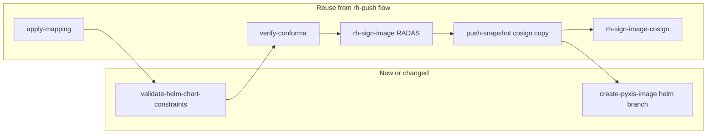

# Helm OCI release pipeline ([registry.redhat.io](http://registry.redhat.io))

## Context from the codebase

**Baseline pipeline:** `[pipelines/managed/rh-push-to-registry-redhat-io/rh-push-to-registry-redhat-io.yaml](release-service-catalog/pipelines/managed/rh-push-to-registry-redhat-io/rh-push-to-registry-redhat-io.yaml)` already orchestrates: `collect-data` → `apply-mapping` → `verify-conforma` → `rh-sign-image` (RADAS) → `push-snapshot` → `rh-sign-image-cosign` → `create-pyxis-image` → `push-rpm-data-to-pyxis` → …

**Helm pipeline fork** `[rh-push-helm-chart-to-registry-redhat-io](release-service-catalog/pipelines/managed/rh-push-helm-chart-to-registry-redhat-io/rh-push-helm-chart-to-registry-redhat-io.yaml)` omits `**push-rpm-data-to-pyxis`** (RPM/SBOM `content_sets` work is for container images, not Helm OCI charts); `run-file-updates` runs after `create-pyxis-image` instead.

**Why “skopeo inspect fails” is partly outdated for us:** Non-`--raw` inspect fails on Helm OCI artifacts, but tasks already use `--raw` in the critical paths (e.g. `[push-snapshot.yaml](release-service-catalog/tasks/managed/push-snapshot/push-snapshot.yaml)` line ~369, `[rh-sign-image-cosign.yaml](release-service-catalog/tasks/managed/rh-sign-image-cosign/rh-sign-image-cosign.yaml)` ~310, `[create-pyxis-image.yaml](release-service-catalog/tasks/managed/create-pyxis-image/create-pyxis-image.yaml)` ~266).

**Architectures:** `[release-service-utils/utils/get-image-architectures](release-service-utils/utils/get-image-architectures)` already detects `application/vnd.cncf.helm.config.v1+json` and emits a synthetic single-arch JSON so downstream steps get a stable shape.

**Copy mechanism:** `push-snapshot` uses `cosign copy` (not plain `skopeo copy`), which is appropriate for copying the digest-referenced artifact to `quay.io/redhat-prod/...` / `registry.redhat.io` destinations.

**Conflict with Jira / refinement doc:** `[create-pyxis-image](release-service-catalog/tasks/managed/create-pyxis-image/create-pyxis-image.yaml)` currently **detects Helm and skips Pyxis entirely** (lines ~272–280, ~524–528). The MVP explicitly wants charts **in Pyxis as containerImages**. That skip must be **replaced** with a Helm-specific creation path (or a dedicated task) before this feature is complete.

## Recommended shape of work

### 1. New managed pipeline (preferred over branching one mega-pipeline)

Add something like `pipelines/managed/rh-push-helm-chart-to-registry-redhat-io/rh-push-helm-chart-to-registry-redhat-io.yaml` by **copying** the structure of `rh-push-to-registry-redhat-io` and inserting one new task in the DAG (after `apply-mapping`, before `verify-conforma`).

**Why separate:** Your refinement doc calls for **KRD CI to only allow this pipeline for delivery repos ending in `-chart` / `-helmchart`**. A distinct pipeline reference is easier to enforce in `[konflux-release-data](konflux-release-data)` constraints (same pattern as `[constraints/product/rhtap-shared-team.yaml](konflux-release-data/constraints/product/rhtap-shared-team.yaml)` pinning `rh-push-to-registry-redhat-io`).

**Not a rename of the original pipeline:** The implementation must keep **two** independent `Pipeline` resources:

- **Unchanged container path:** [pipelines/managed/rh-push-to-registry-redhat-io/rh-push-to-registry-redhat-io.yaml](release-service-catalog/pipelines/managed/rh-push-to-registry-redhat-io/rh-push-to-registry-redhat-io.yaml) — `metadata.name: rh-push-to-registry-redhat-io` (no `validate-helm-chart-snapshot`; default Helm handling in `create-pyxis-image` as before).
- **New path:** [pipelines/managed/rh-push-helm-chart-to-registry-redhat-io/rh-push-helm-chart-to-registry-redhat-io.yaml](release-service-catalog/pipelines/managed/rh-push-helm-chart-to-registry-redhat-io/rh-push-helm-chart-to-registry-redhat-io.yaml) — `metadata.name: rh-push-helm-chart-to-registry-redhat-io` (adds `validate-helm-chart-snapshot`, `processHelmCharts: "true"` where applicable).

Copying the YAML from the baseline and editing in a **new directory** can look like a “rename” or huge RENAME in `git diff`; that is still **add second pipeline**, not **replace** the first. Reviews should confirm both files exist on the branch and `rh-push-to-registry-redhat-io` still matches `development` for unrelated lines.

### 2. New task: validate Helm snapshot vs delivery metadata

**Inputs:** Mapped snapshot (`snapshotPath` + `dataPath`), same as other tasks.

**Per component / repository:**

1. `skopeo inspect --retry-times 3 --raw docker://$containerImage` (digest reference from snapshot).
2. Confirm Helm OCI: `config.mediaType == application/vnd.cncf.helm.config.v1+json` (or equivalent artifact detection consistent with existing helpers).
3. **Version vs tag:** Read chart version from OCI annotations, e.g. `org.opencontainers.image.version` (see Jira example). Compare to **each** release tag in the mapped repository’s `tags` array. Define normalization rules explicitly (Konflux often uses `_` where Helm uses `+` in semver metadata, e.g. `0.1.66_adba59e` vs `0.1.66+adba59e`).
4. **Chart name vs delivery repo base name:** Compare `org.opencontainers.image.title` (or config blob `Chart.yaml` if you prefer fetching the config blob) to the **basename** of the delivery repository after mapping. Align with product expectation: “base name of the delivery repo” likely means the final repository segment (and possibly the `----` → `/` mapping used elsewhere—mirror what `[publish-pyxis-repository](release-service-catalog/tasks/managed/publish-pyxis-repository/publish-pyxis-repository.yaml)` / Pyxis use).

**Failure mode:** Fail the task with a clear message if any check fails (MVP enforcement).

**Tests:** Add a `tests/` entry under the new task mirroring `[tasks/managed/push-snapshot/tests/](release-service-catalog/tasks/managed/push-snapshot/tests/)` (mock `skopeo` / fixture JSON).

### 3. Fix Pyxis: stop skipping Helm; add a Helm-specific path

**What `processHelmCharts` actually does:** It only removes the **early skip** at lines 278–284 in `[create-pyxis-image.yaml](release-service-catalog/tasks/managed/create-pyxis-image/create-pyxis-image.yaml)`. It does **not** implement a separate Pyxis code path. After the gate, the task still runs the **same** container-oriented flow: `skopeo inspect --raw`, `get-image-architectures` (for Helm this already emits one synthetic `linux/amd64` row with `configMediaType`—see `[get-image-architectures](release-service-utils/utils/get-image-architectures)`), `oras manifest fetch`, optional layer gzip expansion, then `create_container_image` + optional `cleanup_tags`.

**Why that may still break or behave badly for Helm OCI:**

- `**create_container_image` / Pyxis GraphQL** may assume classic image manifests; Helm charts use chart layers (often `.tgz` / non-gzip patterns)—behavior is **not** proven by flipping the parameter alone; **staging validation with Pyxis owners** is still required.
- `**includeLayers` / duplicate `top_layer_id`** logic was written for container layers; charts may need `includeLayers: false` in data or special-casing (see existing comments in the task around lines 319–327).
- **Dockerfile fetch** (`oras pull` … `Dockerfile`) usually fails for Helm artifacts; the task already tolerates missing Dockerfile (`DOCKERFILE_PATH` empty)—confirm `create_container_image` accepts that for charts.
- **Rest of the release pipeline** (EC/conforma, push-snapshot, signing) has its own Helm edge cases; those are **outside** this one `if` block.

**Option A (minimal change):** Parameter-gated skip removal + validate end-to-end in stage.

**Option B:** New task `create-pyxis-image-helm` used only from the Helm pipeline, keeping the standard pipeline behavior unchanged. Lower risk for existing container releases.

**Coordination:** Ryan’s comment (“different logic needed for pyxis”) matches this gap—validate required GraphQL fields / `create_container_image` behavior for Helm manifests with the Pyxis owners before locking implementation.

### 4. Signing

- **RADAS (`rh-sign-image`):** Uses raw manifest; for a single Helm manifest, digest list behavior should remain a single top-level digest (verify with one real chart in staging).
- **Cosign (`rh-sign-image-cosign`):** Signs `registry:tag@digest`; should work for OCI artifacts if the registry supports it (same as today). Add an integration-style test or staging run to confirm.

### 5. Out-of-repo follow-ups (track as dependencies, not all in release-service-catalog)

| Area                     | Notes                                                                                                                                                                                                                                      |
| ------------------------ | ------------------------------------------------------------------------------------------------------------------------------------------------------------------------------------------------------------------------------------------ |
| **konflux-release-data** | New RPA `pipelineRef` to the new YAML; constraints: delivery repo suffix `-chart` / `-helmchart`; `[tests/sa_mappings.yaml](konflux-release-data/tests/sa_mappings.yaml)` service account mapping; KRD CI rule—owned by your other ticket. |
| **Clair / scanner**      | Refinement doc: treat like bundles; separate team.                                                                                                                                                                                         |
| **Enterprise Contract**  | `verify-conforma` may need policy tweaks or `enterpriseContractExtraRuleData` for Helm-only releases—confirm with conforma/ec owners if builds fail.                                                                                       |

### 6. Clair (brief)

**Clair** is a container vulnerability scanner. The refinement doc asks the Clair wrapper to avoid registry API calls that break on Helm artifact types and to grade charts like bundles—handled outside this pipeline work unless you own that service.

## Implementation order

1. Land **validation task** + **helm pipeline** wiring (push/sign path should largely work unchanged).
2. Implement **Pyxis Helm path** and remove or narrow the “skip Helm” branch.
3. Add **integration tests** in catalog; run existing `[scripts/run-local-tests.sh](release-service-catalog/scripts/run-local-tests.sh)` for touched tasks. **Depends on Konflux build:** see *Konflux build pipeline prerequisite* under §7 — `**build-pipeline-config`** must expose a Helm OCI pipeline (or approved custom build path); the `**build-helm-chart-oci-ta`** task in `**konflux-ci/build-definitions`** is the intended building block for that pipeline.
4. Coordinate **konflux-release-data** MR with releng (pipeline allowlist + repo naming).

## Open decisions to resolve with stakeholders (before coding Pyxis/validation details)

1. **Exact string match rules** for version (semver build metadata `_` vs `+`) and chart name vs repo basename (case sensitivity, strip `-chart` suffix or not).
2. **Whether** `create-pyxis-image` behavior for Helm should change globally or only when invoked from the new pipeline (Option B).

### 7. Integration test suite (`integration-tests/rh-push-helm-chart-to-registry-redhat-io`)

**In scope:** Yes — the plan explicitly includes adding this suite (not only unit tests for `validate-helm-chart-snapshot`). It is the e2e proof for the new Helm pipeline.

**Compared to the container suite:** [integration-tests/rh-push-to-registry-redhat-io/](release-service-catalog/integration-tests/rh-push-to-registry-redhat-io/) uses a **Dockerfile** fixture and `rh-push-to-registry-redhat-io` in the RPA. The Helm suite uses a **Helm chart** from **e2e-base** and `pipelineRef` to `**pipelines/managed/rh-push-helm-chart-to-registry-redhat-io/...`**, with snapshot / ReleasePlan templates adjusted for chart OCI. Both are full e2e: real GitHub repos, pushes to `**quay.io/redhat-pending`**, **staging Pyxis**, same releng-style secrets pattern.

**Pattern:** Mirror [integration-tests/rh-push-to-registry-redhat-io/](release-service-catalog/integration-tests/rh-push-to-registry-redhat-io/) — `README.md`, `resources/managed/rpa.yaml` (template), `vault/secrets.yaml`, `test.sh`, `test.env`. The **RPA template** must reference `**pipelines/managed/rh-push-helm-chart-to-registry-redhat-io/rh-push-helm-chart-to-registry-redhat-io.yaml`** (same bundle resolution pattern as the existing rh-push test).

#### Konflux **build** pipeline prerequisite (integration / full e2e)

The `**run-test.sh`** harness is **not** release-only: after merge it **waits for a tenant `PipelineRun`** (`wait_for_plr_to_appear` / `wait_for_plr_to_complete` in `[integration-tests/run-test.sh](release-service-catalog/integration-tests/run-test.sh)`). That run is the **Konflux build** (PaC), which must produce a **Snapshot** with a real Helm OCI digest before the **managed release** pipeline (`release-service-catalog`) runs.

- `**build-pipeline-config`** (ConfigMap `build-service/build-pipeline-config`, GitOps from `**konflux-ci/konflux-ci`**, e.g. `[konflux-ci/build-service/core/build-pipeline-config.yaml](https://github.com/konflux-ci/konflux-ci/blob/main/konflux-ci/build-service/core/build-pipeline-config.yaml)`) is the cluster allowlist of build pipeline names → Pipeline bundle images (`quay.io/konflux-ci/tekton-catalog/pipeline-*@sha256:...`). Pipeline YAML is authored in `**konflux-ci/build-definitions`** (`pipelines/…`), published as bundles, then referenced from that ConfigMap.
- **Observed gap:** On clusters checked (e.g. **stone-stg-rh01**), the allowlist had **no** Helm OCI pipeline name—only docker, FBC, tekton-bundle, maven-zip, etc. The **Component** annotation `**build.appstudio.openshift.io/pipeline`** must match a `**name:`** in that ConfigMap, or the build path will not match what the **e2e-base** branch expects for Helm.
- **Existing building block (task):** Konflux already ships the Tekton **Task** `**build-helm-chart-oci-ta`** in `[konflux-ci/build-definitions](https://github.com/konflux-ci/build-definitions)` under `task/build-helm-chart-oci-ta/` (Trusted Artifacts; the older `**build-helm-chart`** task is deprecated in favor of this). It packages the chart and `**helm push`**es to OCI; see also `task/build-helm-chart-oci-ta/0.1/recipe.yaml` (layered on `build-helm-chart`). What may still be missing on a given cluster is a Pipeline bundle (e.g. `pipeline-helm-chart-oci-ta`) that composes this task with the rest of the build graph and is registered in `**build-pipeline-config`**—that is a **platform / build-team** rollout, not something `release-service-catalog` alone can fix.
- **Planning implication:** When **implementing or hardening** Helm **integration-tests**, budget explicit work to either (1) **coordinate with the team that owns `build-pipeline-config`** (or internal GitOps) to **allowlist** the Helm build pipeline bundle and digest, or (2) follow an org-approved **custom `.tekton/`** / pipeline path if that bypasses the default allowlist. Until then, full e2e may remain **blocked on the build step** even though the **release** pipeline and `**validate-helm-chart-snapshot`** work in `release-service-catalog` are done.

**What the fixture must contain (conceptually):**

- **ReleasePlanAdmission / ReleasePlan** — Same *style* as the container rh-push e2e: generated from templates with `RELEASE_CATALOG_GIT_*` pointing at the catalog revision under test; pipeline name/path must be the **Helm** pipeline, not `rh-push-to-registry-redhat-io`.
- **Snapshot** — Produced by the **same flow as container e2e**: Konflux **build** runs first; the snapshot references the **built** Helm OCI digest. At least one **component** whose `containerImage` is a **digest-pinned Helm OCI artifact** (`quay.io/.../chart-repo@sha256:...`), with `repositories` / `tags` matching what `validate-helm-chart-snapshot` expects (chart name vs mapped repo basename, version vs tags). **Alternate approaches** (inject a pre-built snapshot without running build) would require **harness changes**; stock `run-test.sh` does **not** skip the build.
- **Where the chart OCI comes from** — Options: (1) **Pin a stable digest** for a chart you maintain or publish (e.g. sample shared by the team — such as the previously discussed `poc-rhoai-operator-helm` Quay tag, once digest and mapping are agreed); (2) push a test chart to an allowed Quay org/path and reference that; (3) extend the test harness to build/push Helm OCI in setup (more work). **Concrete image digest + mapping values should come from the team** (no guessing in CI).

**Pyxis / secrets reuse:**

- Reuse the **same Pyxis environment and secret pattern** as [integration-tests/rh-push-to-registry-redhat-io/](release-service-catalog/integration-tests/rh-push-to-registry-redhat-io/) — typically **stage** Pyxis and the existing vault-encrypted test credentials (same “test product” posture as today).
- The **Helm run creates additional `containerImage` / repository metadata** for the chart (via `create-pyxis-image` + `processHelmCharts`); that is **additive** to whatever the container e2e already records, not a different Pyxis “account.” Delivery **repo names** in the snapshot should follow the same **redhat-pending / rhtap----** mapping style the rh-push test uses, with names aligned to the chart so validation passes — **confirm with releng** if a dedicated `-chart` test repo string is required vs reusing the same naming pattern with a second component.
- **One suite vs combined:** Prefer a **dedicated** `integration-tests/rh-push-helm-chart-to-registry-redhat-io/` directory (Helm-only snapshot) so failures are isolated; both suites can share **docs, lib, and vault layout** with the container rh-push test.

**Concrete fixture (integration test harness; generic names, not tied to any product team):** chart `**rh-push-helm-e2e-fixture`**, tag `**0.1.0_e2e001`** (SemVer `0.1.0+e2e001`).

- **Helm manifest annotations** (from `skopeo inspect --raw` on the pushed chart digest):  
  - `org.opencontainers.image.title`: `rh-push-helm-e2e-fixture`  
  - `org.opencontainers.image.version`: `0.1.0+e2e001`  
  - Config `mediaType`: `application/vnd.cncf.helm.config.v1+json`
- **Mapped delivery repo + tags** (must satisfy `[validate-helm-chart-snapshot](release-service-catalog/tasks/managed/validate-helm-chart-snapshot/validate-helm-chart-snapshot.yaml)`: basename after `----`→`/` equals **title**; each tag with first `_`→`+` equals **version**):  
  - Example `repositories[].url` (no tag): `quay.io/redhat-pending/rhtap----release-team----rh-push-helm-e2e-fixture` → basename `rh-push-helm-e2e-fixture`.  
  - Example `tags`: `["0.1.0_e2e001"]` → normalizes to `0.1.0+e2e001`.  
  **Releng** may require a different `rhtap----…` prefix; keep the **terminal segment** (`rh-push-helm-e2e-fixture`) and tags aligned with `Chart.yaml` in `[e2e-base` branch `rh-push-helm-chart-to-registry-redhat-io-base](https://github.com/hacbs-release-tests/e2e-base)` (`dist/chart/Chart.yaml`).
- **Source of the chart OCI:** the **e2e-base** branch builds this fixture in the releng test harness; it is **not** copied from third-party product repos. Product teams can use the same pattern with their own chart name/version and RPA mapping.

**Pyxis “phony product” / stage:**

- The existing rh-push integration test already targets **Pyxis stage** (`pyxis.server: stage` in vault) and **test-only** repository names under the releng test mapping — you do **not** need a separate “phony product” concept beyond what that harness already encodes (component name, tags, mapped delivery repos).
- For **helm-specific** behavior (`processHelmCharts`, `publish-pyxis-repository`), confirm with releng whether stage Pyxis + the same `pyxis-secret` / API key pattern are sufficient for `create_container_image` with Helm, or if a dedicated test repository in Comet/Pyxis must be provisioned — **do not invent** product IDs or repo names; follow the same approval path as the existing `rh-push-to-registry-redhat-io` e2e secrets.

**CI wiring:** Optionally add the new pipeline path to periodic e2e lists (e.g. [integration-tests/e2e-tests-periodic-pipeline.yaml](release-service-catalog/integration-tests/e2e-tests-periodic-pipeline.yaml) and [scripts/find_release_pipelines_from_pr.sh](release-service-catalog/scripts/find_release_pipelines_from_pr.sh)) alongside other managed pipelines, after the folder exists.

**Local runs:** `./scripts/run-local-tests.sh integration-tests/rh-push-helm-chart-to-registry-redhat-io` (or targeted path) requires a working kind cluster per existing README; same as other integration tests.

**Cluster, kubeconfig, cleanup:** End-to-end `./run-test.sh` runs use **stone-stg-rh01**; set `**KUBECONFIG`** (e.g. `~/.kube/config-stg-rh01`). Namespaces: `**dev-release-team-tenant**` (tenant / Release) and `**managed-release-team-tenant**` (managed / RPA)—see [integration-tests/README.md](release-service-catalog/integration-tests/README.md). After `**--skip-cleanup**` debugging, remove leftovers with [integration-tests/utils/cleanup-resources.sh](release-service-catalog/integration-tests/utils/cleanup-resources.sh) and [scripts/delete-branches.sh](release-service-catalog/scripts/delete-branches.sh).

### Observed reference run: `rh-push-to-registry-redhat-io` (container parity)

One successful **container** e2e (`./run-test.sh rh-push-to-registry-redhat-io --skip-cleanup`) on **stone-stg-rh01** showed the harness shape the Helm suite mirrors:

- **Per-run repo:** `hacbs-release-tests/rh-push-to-registry-redhat-io-b2d27993` (from `e2e-base` branch `rh-push-to-registry-redhat-io-base`).
- **Application / component:** `rh-redhat-app-b2d27993`, `rh-push-to-registry-redhat-io-b2d27993`.
- **Tenant build PipelineRun:** `rh-push-to-registry-redhat-io-b2d27993-on-push-g4zxg` (18 tasks, 16 succeeded per progress output).
- **Managed release PipelineRun:** `managed-bkxpb` in `managed-release-team-tenant`.
- **Release:** `rh-redhat-app-b2d27993-20260324-151108-000-8e6e191-lxbxx` (merge SHA `8e6e1911dccda59605442e4d69f6b77b68e3d89d`).
- **Post-run verification (Release status):** `catalog_url` on catalog.stage.redhat.com for `rhtap/rh-advisories-component`; file-update MR on GitLab `hacbs-release-tests/app-interface`; image `quay.io/redhat-pending/rhtap----rh-advisories-component:latest` with digest `sha256:9c19c7b72d50828e45e62fd1709a751dabbc46d208ca614c4eaf13ba79cd657e`, arch `amd64`.

The Helm suite uses the same steps; `test.sh` adds `**skopeo inspect --raw`** when plain inspect fails so Helm OCI artifacts verify like production tasks.